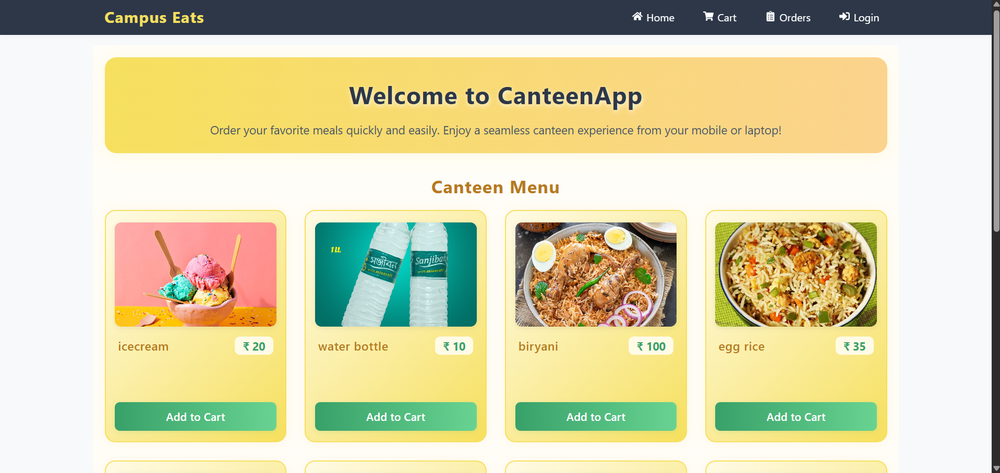
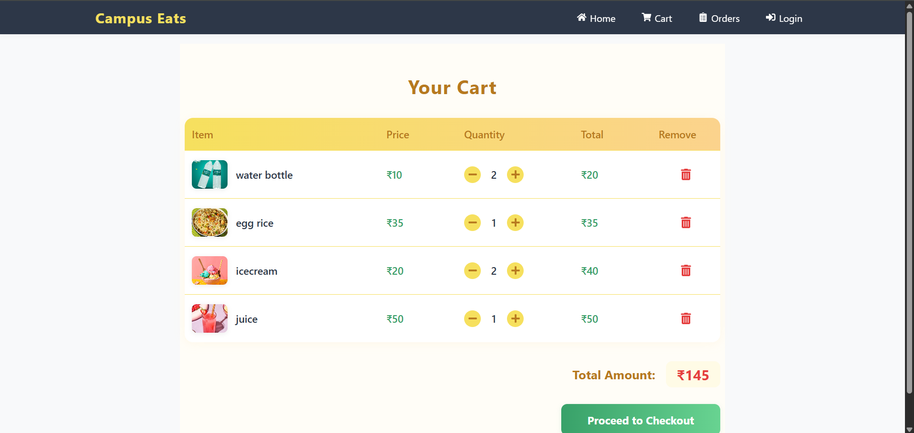

# 🍽️ College Canteen Ordering System

A modern web-based canteen ordering platform designed for college use.  
Students can browse food items, add them to a cart, and manage orders — making the canteen experience smoother and faster.

---

## 🚀 Project Status

✅ **Frontend Completed (React.js)**  
🔧 **Backend in Progress (Planned with Node.js & Firebase)**  
🔄 Regular feature improvements and updates coming soon!

---

## 📁 Project Structure (Frontend)

- 🏠 **Home Page** – Landing page displaying food menu
- 🛒 **Cart Page** – View and manage selected items
- 📦 **Orders Page** – Placeholder for viewing order history
- 🔐 **Login Page** – Basic login UI (not functional yet)
- 📝 **Register Page** – Signup form layout
- 🛠️ **Admin Page** – Placeholder admin dashboard

---

## 📌 Key Features (Frontend)

- ⚛️ Built with modern React.js components
- 📱 Fully responsive UI for mobile and desktop
- 🧾 Cart system with localStorage
- ✅ Modular code and clean UI structure

---

## 🛠️ Technologies Used

| Purpose         | Tech Stack             |
|----------------|------------------------|
| Frontend       | React.js, CSS3         |
| State Storage  | localStorage (for now) |
| Backend (Plan) | Node.js, Express.js    |
| Auth/DB (Plan) | Firebase               |
| Deployment     | GitHub Pages / Netlify (soon) |

---

## 📅 Future Roadmap

- 🔌 Backend integration with Node.js + Express
- 🔐 Firebase Authentication for user login/register
- 💾 Firestore/Realtime DB for order storage
- 💳 Online payment simulation (optional)
- 🧑‍🍳 Admin dashboard to manage canteen orders
- 🚀 Deployment to Netlify or Vercel

---

## 📸 Screenshots

### 🏠 Home Page

### 🛒 Cart Page

## 🙌 Contributions

This is a **personal project** under development.  
Feel free to open an issue or suggest improvements via pull requests.

---

## 🧑‍💻 Developer

**Rahul Dravid Palani**  
B.Tech Student | Frontend Web Developer  
**Project Guide**: ChatGPT (Code Buddy 😎)

---

## 🔗 Project Links

- GitHub Repo: [Click Here](https://github.com/PalaniRahulDravid/canteen-order-website)
- Live Demo: *(coming soon)*

